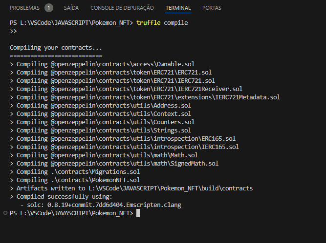
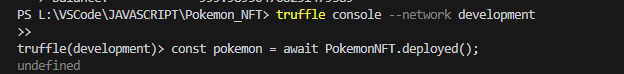
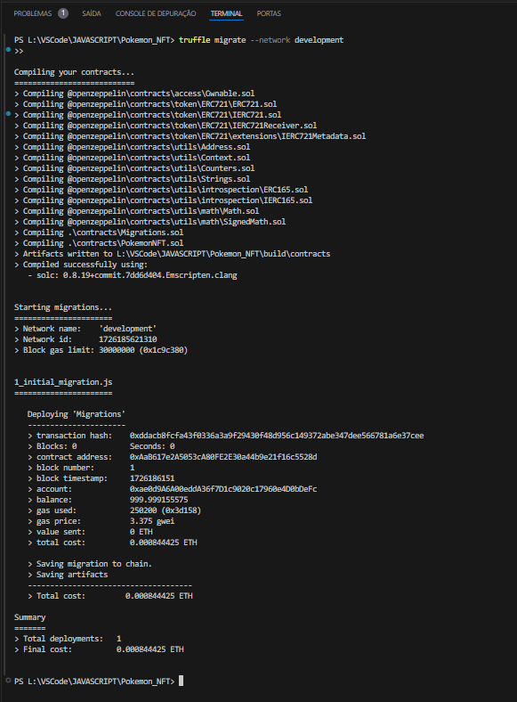
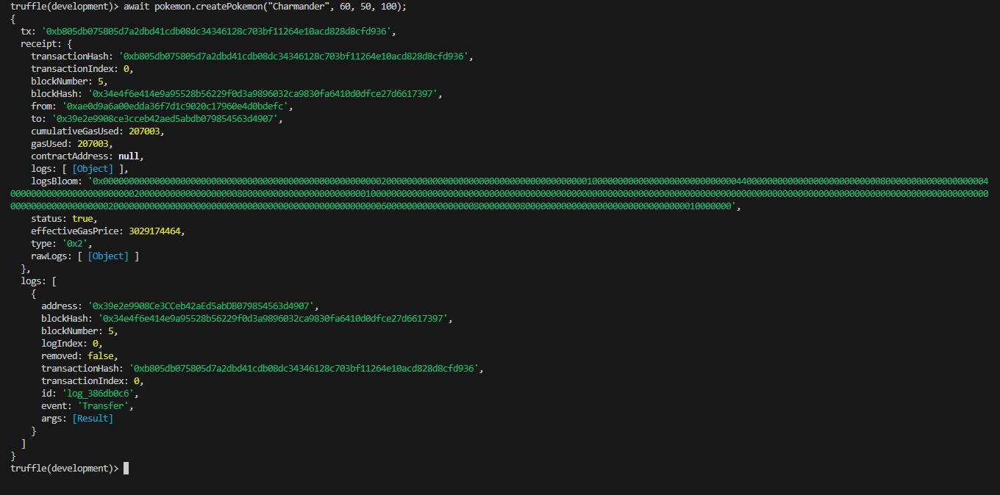
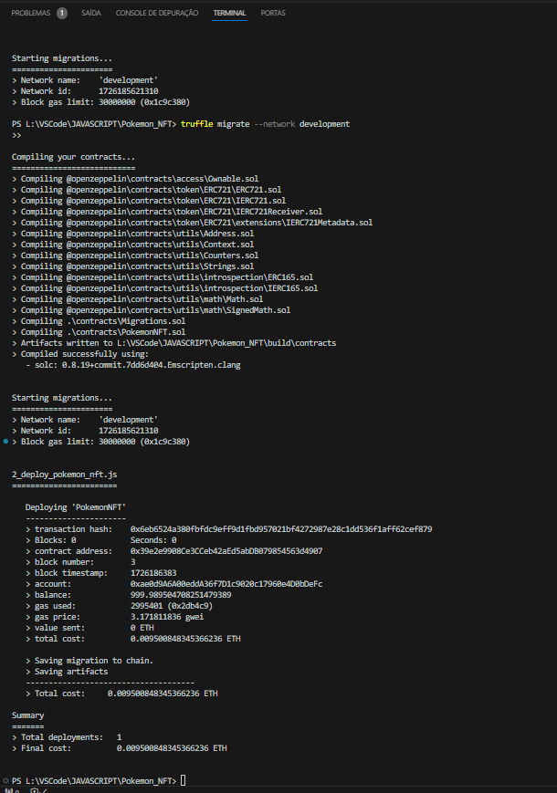

# Pokémon NFT com Blockchain

Este projeto tem como objetivo a criação de um **NFT de Pokémon** utilizando **Solidity** e o padrão **ERC-721** em uma blockchain local. Além de criar os NFTs, o projeto permite que os Pokémons criados batalhem entre si, simulando um jogo de batalhas de Pokémon. O deploy do contrato foi realizado localmente utilizando **Ganache** e o framework **Truffle**.

## Objetivo do Desafio

O objetivo deste desafio é aplicar o conceito de contratos inteligentes (smart contracts) e NFTs (tokens não fungíveis) usando Solidity e o padrão ERC-721. Simulando um jogo de batalhas de Pokémon, cada Pokémon é um NFT único que pode ser criado, armazenado na blockchain, e usado em batalhas com outros Pokémons.

## Tecnologias Utilizadas

- **Solidity**: Linguagem de programação para contratos inteligentes na blockchain Ethereum.
- **Truffle**: Framework de desenvolvimento para contratos inteligentes que facilita o deploy e a interação com a blockchain.
- **Ganache**: Blockchain local que simula a rede Ethereum para desenvolvimento e testes.
- **MetaMask**: Carteira de criptomoedas para interagir com a blockchain.
- **OpenZeppelin**: Biblioteca com contratos padrões para Solidity, incluindo a implementação do padrão ERC-721 para NFTs.
- **Node.js**: Ambiente para rodar scripts JavaScript no backend, além de gerenciar dependências via npm.

## Estrutura do Projeto

Pokemon_NFT/
├── contracts/
│   ├── Migrations.sol              # Contrato de migração para Truffle
│   ├── PokemonNFT.sol              # Contrato principal que cria os NFTs e define as batalhas
├── migrations/
│   ├── 1_initial_migration.js      # Script de migração inicial
│   ├── 2_deploy_pokemon_nft.js     # Script de migração do contrato PokemonNFT
├── scripts/
│   ├── deploy.js                   # Script opcional para deploy (não usado aqui)
├── test/
│   ├── PokemonNFT.test.js          # Arquivo de testes (opcional)
├── build/                          # Diretório gerado após compilar os contratos
├── truffle-config.js               # Configuração do Truffle para rodar no Ganache
├── package.json                    # Dependências npm do projeto
├── README.md                       # Documentação do projeto
└── .gitignore                      # Arquivos ignorados no controle de versão

## Ferramentas e Bibliotecas Instaladas

1. **Truffle:** Framework para desenvolvimento e gerenciamento de contratos inteligentes.

        Instalação:
        npm install -g truffle

2. **Ganache CLI:** Simulador de blockchain local.

        Instalação:
        npm install -g ganache

3. **OpenZeppelin:** Biblioteca com contratos padrões como ERC-721.

        Instalação:
        npm install @openzeppelin/contracts

4. **Node.js:** Ambiente de execução JavaScript (inclui npm para gerenciar pacotes).

        Verificação:
        node -v
        npm -v

## Imagens do Processo

### Compilação do Contrato

A seguir, a imagem da compilação bem-sucedida do contrato **PokemonNFT**.

### Contrato PokemonNFT Implantado

A seguir, a imagem que mostra o contrato **PokemonNFT** implantado com sucesso na blockchain local.

### Implantação do Contrato Migrations

A seguir, a imagem que mostra a implantação do contrato **Migrations** na blockchain local.

### Novo Pokémon NFT Criado

A seguir, a imagem que mostra a criação de um novo Pokémon NFT utilizando o contrato implantado.

### Re-Migração e Deploy do Contrato PokemonNFT

A seguir, a imagem que mostra a re-migração e o deploy do contrato **PokemonNFT** na blockchain local.

## Como Rodar o Projeto

- **Pré-requisitos**

Certifique-se de ter o Node.js, Truffle e Ganache instalados globalmente. Além disso, configure o MetaMask no navegador para interagir com o Ganache, se necessário.

- **Passos para Rodar Localmente**

    1. **Clone o repositório:**
        git clone <URL_DO_REPOSITORIO>
        cd Pokemon_NFT

    2. **Instale as dependências:**
        npm install

    3. **Inicie o Ganache:** Inicie o Ganache CLI ou a versão Desktop. No terminal, execute:
        ganache

        Isso criará uma blockchain local no endereço <http://127.0.0.1:8545>.

    4. **Configuração do truffle-config.js:**
        Verifique se o arquivo truffle-config.js está configurado corretamente para a rede local Ganache:

        module.exports = {
            networks: {
            development: {
                host: "127.0.0.1",
                port: 8545,
                network_id: "*", // Conecta em qualquer network ID
                },
            },
            compilers: {
                solc: {
                    version: "0.8.19", // Versão do Solidity
                }
            }
        };

    5. **Compile os contratos: Para compilar os contratos, execute:**
        truffle compile

    6. **Faça o deploy dos contratos:** Agora, execute o deploy dos contratos para a blockchain local:
        truffle migrate --network develop**ment

    7. **Interaja com o contrato via Truffle Console:** Abra o Truffle Console para interagir com o contrato:
        truffle console --network development

        Exemplo de comandos para criar Pokémons e batalhas:
        const pokemon = await PokemonNFT.deployed();
        await pokemon.createPokemon("Charmander", 60, 50, 100); // Criar um novo Pokémon
        await pokemon.battle(1, 2); // Iniciar uma batalha entre dois Pokémons

## (Opcional) Configuração com MetaMask

    1. Abra o MetaMask no navegador e configure uma rede personalizada:
        RPC URL: http://127.0.0.1:8545
        Chain ID: 1337

    2. No Ganache, copie a chave privada de uma das contas e importe-a no MetaMask para ver o saldo e as transações.

## Funções Implementadas no Contrato

- **createPokemon:** Cria um novo Pokémon NFT com atributos como ataque, defesa e HP.
- **battle:** Inicia uma batalha entre dois Pokémons, reduzindo o HP com base nos ataques e defesas.
- **getHp:** Retorna o HP atual de um Pokémon.
- **pokemons:** Um mapeamento que armazena os atributos dos Pokémons criados.

## Desafios Enfrentados

Durante o desenvolvimento do projeto, alguns desafios foram superados, como:

- Configuração correta do compilador Solidity para suportar as bibliotecas OpenZeppelin.
- Deploy local utilizando o Ganache para testes.
- Integração e interação com o MetaMask para visualizar transações.

## Conclusão

Este projeto demonstrou como criar e interagir com NFTs na blockchain, além de implementar funcionalidades básicas de batalha entre Pokémons. O uso de ferramentas como Truffle e Ganache foi essencial para facilitar o desenvolvimento e o teste local, permitindo uma experiência prática de contratos inteligentes na blockchain.

## Licença

Este projeto está licenciado sob a licença MIT. Veja o arquivo LICENSE para mais detalhes.
